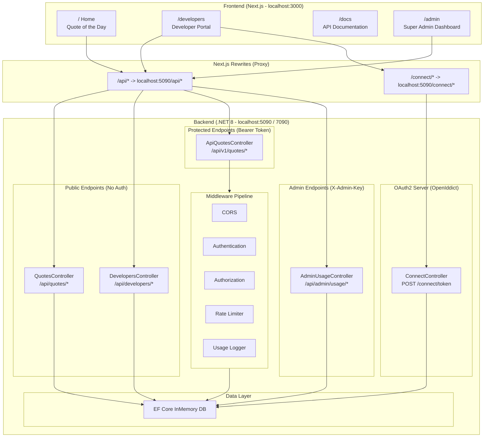
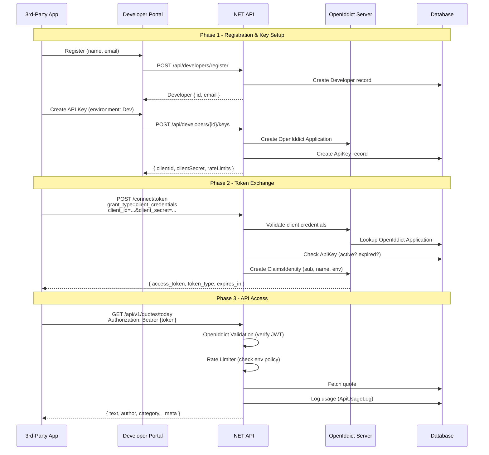
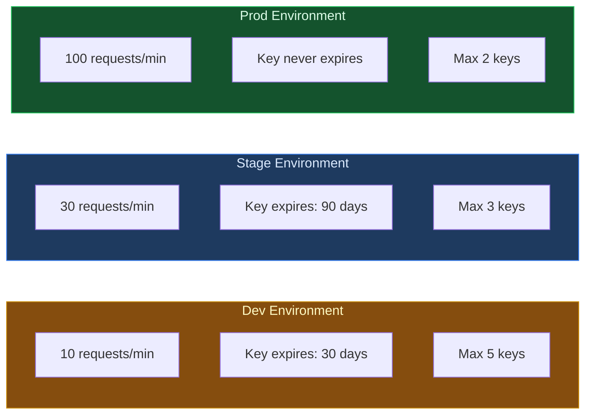
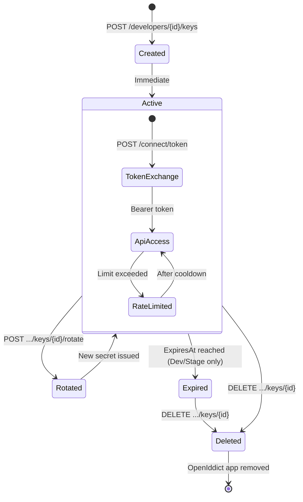
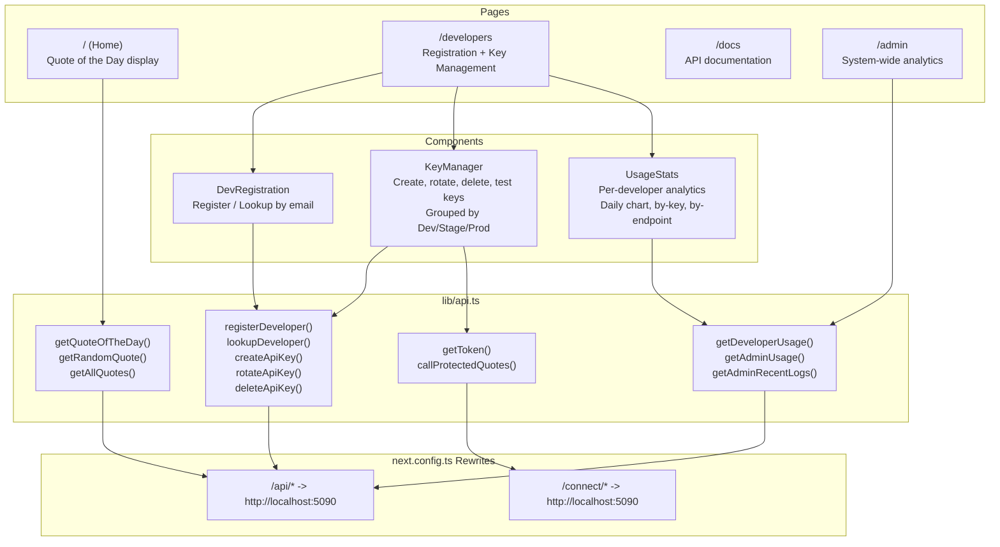

# QuoteOfTheDay - Architecture Document

## Overview

QuoteOfTheDay is a full-stack application demonstrating OAuth2 machine-to-machine (M2M) authentication with self-service API key management. The main app serves quotes publicly, while third-party developers register for controlled API access with environment-based rate limiting and usage analytics.

## System Architecture



## Data Model

```mermaid
erDiagram
    Developer ||--o{ ApiKey : "has many"
    ApiKey ||--o{ ApiUsageLog : "generates"
    Developer ||--o{ ApiUsageLog : "owns"

    Developer {
        Guid Id PK
        string Name
        string Email UK
        DateTime RegisteredAt
    }

    ApiKey {
        Guid Id PK
        string Label
        KeyEnvironment Environment "Dev | Stage | Prod"
        string ClientId UK
        string ClientSecret
        DateTime CreatedAt
        DateTime ExpiresAt "null for Prod"
        bool IsActive
        Guid DeveloperId FK
    }

    ApiUsageLog {
        long Id PK
        string ClientId IX
        string Endpoint
        string Method
        int StatusCode
        string Environment
        long ResponseTimeMs
        DateTime Timestamp IX
        Guid ApiKeyId FK
        Guid DeveloperId IX
    }

    Quote {
        int Id PK
        string Text
        string Author
        string Category
    }

    OpenIddictApplication {
        string Id PK
        string ClientId
        string ClientSecret "hashed"
        string DisplayName
        string Permissions "JSON"
    }
```

## OAuth2 Client Credentials Flow



## Request Pipeline


### Middleware Behavior

| Middleware | Scope | Purpose |
|---|---|---|
| **Routing** | All requests | Maps URLs to endpoints |
| **CORS** | All requests | Allows `localhost:3000` origin |
| **Authentication** | All requests | Validates Bearer tokens via OpenIddict |
| **Authorization** | `[Authorize]` endpoints | Rejects unauthenticated requests (401) |
| **Rate Limiter** | `/api/v1/*` | Enforces per-client sliding window limits |
| **Usage Logger** | `/api/v1/*` | Records request details to `ApiUsageLog` |

## Rate Limiting



All rate limiters use a **sliding window** algorithm with 2 segments per minute, partitioned by `client_id` claim. When the limit is exceeded, the API returns:

```json
HTTP 429
{
  "error": "rate_limit_exceeded",
  "message": "Too many requests. Please wait and try again.",
  "retryAfter": 60
}
```

## API Key Lifecycle



## Frontend Architecture



## API Endpoints Reference

### Public (No Authentication)

| Method | Endpoint | Description |
|---|---|---|
| `GET` | `/api/quotes/today` | Today's quote (rotates daily) |
| `GET` | `/api/quotes/random` | Random quote |
| `GET` | `/api/quotes?category=Life` | All quotes, optional filter |
| `GET` | `/api/quotes/categories` | List categories |

### Developer Self-Service (No Authentication)

| Method | Endpoint | Description |
|---|---|---|
| `POST` | `/api/developers/register` | Register `{ name, email }` |
| `GET` | `/api/developers/lookup?email=...` | Find account by email |
| `GET` | `/api/developers/{id}` | Get profile + keys |
| `POST` | `/api/developers/{id}/keys` | Create key `{ environment, label }` |
| `GET` | `/api/developers/{id}/keys/{keyId}` | View key details + secret |
| `POST` | `/api/developers/{id}/keys/{keyId}/rotate` | Rotate secret |
| `DELETE` | `/api/developers/{id}/keys/{keyId}` | Delete key |
| `GET` | `/api/developers/{id}/usage?days=7` | Usage summary |
| `GET` | `/api/developers/{id}/usage/keys/{keyId}` | Per-key usage logs |

### Protected API (Bearer Token Required)

| Method | Endpoint | Rate Limited | Description |
|---|---|---|---|
| `GET` | `/api/v1/quotes/today` | Yes | Quote of the day with metadata |
| `GET` | `/api/v1/quotes/random` | Yes | Random quote with metadata |
| `GET` | `/api/v1/quotes?page=1&pageSize=10` | Yes | Paginated quotes |

### Admin (X-Admin-Key Header Required)

| Method | Endpoint | Description |
|---|---|---|
| `GET` | `/api/admin/usage?days=7` | System-wide usage overview |
| `GET` | `/api/admin/usage/recent?count=50` | Recent API call feed |

## Project Structure

```
dotnet-auth-demo/
├── docs/
│   └── architecture.md              # This document
├── src/AuthDemo.Api/
│   ├── Controllers/
│   │   ├── ConnectController.cs      # OAuth2 token endpoint
│   │   ├── QuotesController.cs       # Public quotes (main app)
│   │   ├── ApiQuotesController.cs    # Protected quotes (3rd party)
│   │   ├── DevelopersController.cs   # Self-service registration & keys
│   │   └── UsageController.cs        # Usage analytics + admin
│   ├── Data/
│   │   └── ApplicationDbContext.cs   # EF Core context
│   ├── Middleware/
│   │   └── ApiUsageLoggingMiddleware.cs
│   ├── Models/
│   │   ├── Quote.cs
│   │   ├── Developer.cs
│   │   ├── ApiKey.cs                 # Includes KeyEnvironment enum
│   │   └── ApiUsageLog.cs
│   └── Program.cs                    # App configuration & seeding
├── frontend/
│   ├── app/
│   │   ├── page.tsx                  # Home - Quote display
│   │   ├── developers/page.tsx       # Developer portal
│   │   ├── admin/page.tsx            # Admin dashboard
│   │   ├── docs/page.tsx             # API documentation
│   │   ├── components/
│   │   │   ├── DevRegistration.tsx   # Register / lookup
│   │   │   ├── KeyManager.tsx        # Key CRUD + testing
│   │   │   └── UsageStats.tsx        # Developer analytics
│   │   └── lib/api.ts               # API client functions
│   └── next.config.ts               # Proxy rewrites
├── tests/AuthDemo.Api.Tests/
└── AuthDemo.sln
```

## Technology Stack

| Layer | Technology | Purpose |
|---|---|---|
| **Backend** | .NET 8 / ASP.NET Core | Web API framework |
| **OAuth2** | OpenIddict 5.8 | Token server + validation |
| **ORM** | EF Core 8 (InMemory) | Data access |
| **Rate Limiting** | ASP.NET Core Rate Limiting | Sliding window per client |
| **Frontend** | Next.js 16 + TypeScript | React SSR/CSR framework |
| **Styling** | Tailwind CSS | Utility-first CSS |
| **Bundler** | Turbopack | Next.js dev server |

## Security Notes

> This is a **demo application**. The following should be changed for production:

- Replace in-memory database with a persistent store (PostgreSQL, SQL Server)
- Replace hardcoded admin key (`super-admin-key-change-me`) with proper admin authentication
- Enable HTTPS enforcement (`DisableTransportSecurityRequirement` should be removed)
- Replace development signing/encryption certificates with production certificates
- Add input validation and CSRF protection to developer registration
- Implement proper secret hashing for API keys (currently stored in plaintext in ApiKey table)
- Add email verification for developer registration
- Restrict developer portal endpoints with authentication
